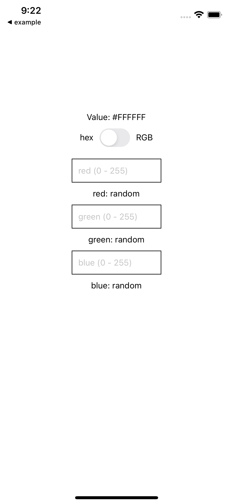
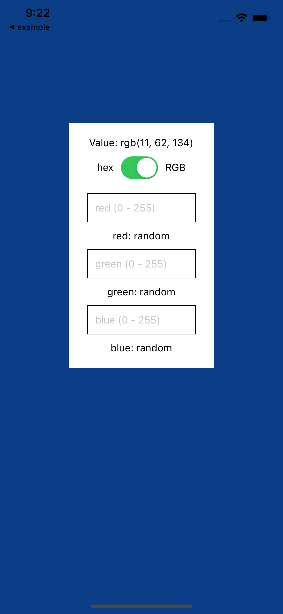
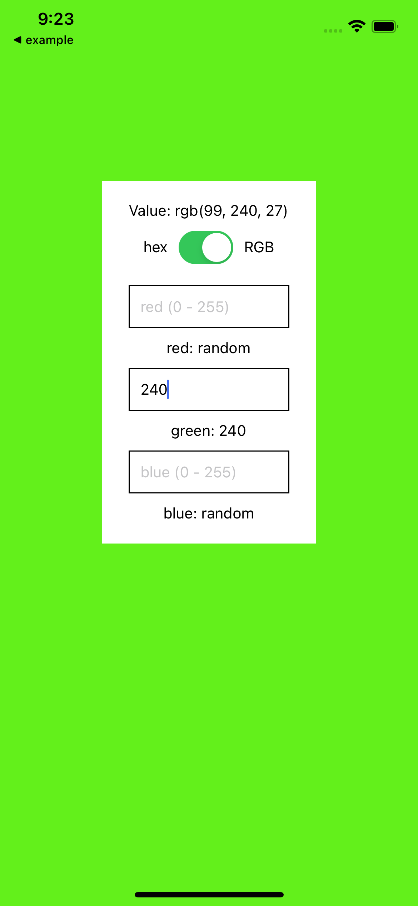
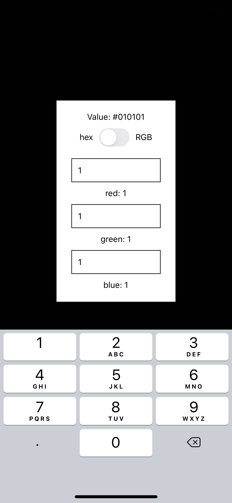

# RNColorApp

## Quick start
To run, make sure you have followed the instructions to setup a react native project for ios

[setup](https://reactnative.dev/docs/environment-setup)

then run in RNColorApp directory

```sh
yarn install
cd ios && pod install && cd ..
yarn react-native run-ios
```

## Images






